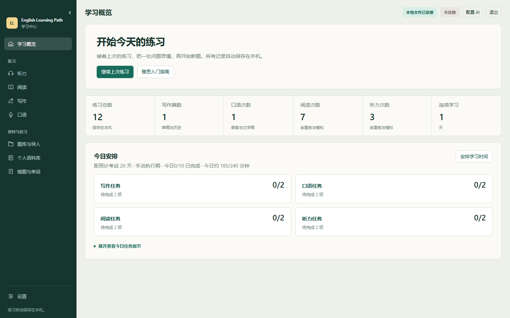

# English Learning Path · 英语学习路径

本地优先的 Windows 英语学习中心，覆盖听力、阅读、写作和口语。基础练习离线可用，AI 批改按需配置。公开程序包不包含商业题库或个人学习资料。

## 下载与启动

发布版在 [Releases](https://github.com/originem0/IELTS-Forge/releases) 下载 `EnglishLearnPath-Windows-x64-Full-版本号.zip`，完整解压后双击 `启动学习中心.exe`。Windows 10/11 x64，无需安装 Node.js、Python、数据库或另外下载语音模型。

首次启动选择长期保存学习数据的文件夹。程序旁 `runtime-data/config.json` 保存目录绑定，API 配置由当前 Windows 账户 DPAPI 独立加密。每个程序副本有自己的配置。

关闭浏览器不会结束后台服务。页面右上角“退出”可关闭当前服务，`结束学习中心.exe` 可结束遗留的学习中心启动器。升级时先结束旧程序，将新版解压到新目录，再绑定原数据目录。不要删除自己的学习数据文件夹，也不要让旧版程序写入已经迁移的档案。

`main` 中的开发变更可能尚未包含在发行版中。当前改动见 [更新说明](docs/RELEASE_NOTES.md)，构建结果见 [GitHub Actions](https://github.com/originem0/IELTS-Forge/actions)。

## 第一次接触雅思

从首页打开“雅思入门指南”。指南从 A 类与 G 类的区别开始，解释四科时长、题目形式、写作 Task 与口语 Part、总分和小分，再用原创中英示例说明听力填空、阅读判断、图表与书信写作，以及口语回答。详细内容按科目展开，考试规则附官方出处。

不用先配置 AI 或寻找题库。指南内可以体验 3 题阅读、写 3 句英语，或回答一个口语问题，再按作答、找依据、改一处并重练的步骤完成第一次复盘。这些是原创热身，不是真题，也不用于估分。熟悉流程后再导入完整题包、安排学习计划。

## 练习与复盘

- 写作支持 Task 1 Academic、Task 1 General、Task 2 和自由写作。两种 Task 1 默认 20 分钟，Task 2 默认 40 分钟。Academic 保留真实题图，General 使用完整书信情境与要点。计时、暂停只读、专注答题、自动保存和历史重写共用同一流程。
- 口语支持 Part 1–3 与自由练习。Part 2 先准备 1 分钟，再录音最多 2 分钟。录音结束后由包内 Whisper 在本机离线转写，保存音频和原始文字，可回听及校对。
- 阅读支持原文与题目并排、可选笔记、划线、标记、暂停、自动保存、确定性判分和依据定位。听力支持离线播放、调速、回退以及播放位置恢复。只有音频和原文的材料作为听音资源，不虚构题目或自动评分。
- 听读完成后可勾选 1–5 道错题，按需生成 AI 讲解与原文引文，支持定位和返回。讲解保存在本机，不改变标准答案与判分。两科历史列表支持逐条确认删除，已有重练记录继续保留。
- 完整题包可以声明三篇阅读或四段听力的模拟试卷。模拟截止时间持久保存，听力按顺序原速播放，复盘恢复自由回听。结果展示题目得分，不能替代正式考试评分。
- 写作和口语报告采用相同章节结构，展示原题、总分与分项、总体反馈、原文标注、确定错误、可选优化、范文和语料。只有明确错误标红，风格建议单独显示；文字稿无法证明发音水平。标注与说明支持双向定位。
- 四科计划每天安排一个主要练习，根据实际到期内容、近七天科目覆盖和练习耗时安排复习。完成作答或复习会关联任务，修改计划保留学习历史。
- 个人语料库由用户触发更新，只整理有答案的已完成或已批改作答，区分口语素材、Task 1 图表与书信、Task 2 表达。自评决定下次复习，单条表达可以暂停，原有内容继续保留。
- 首页汇集错句、单词、语料、主动加入的笔记和听读错题。先回忆再揭晓，每轮最多十分钟；单词可选择看见能懂或主动说写。全部记录、复习进度与删除状态通过本地磁盘 API 保存。

## 题库导入

导航中的“题库与导入”接受整理好的 ZIP 或文件夹，自动配对题目、图片和音频，预览后统一写入。总量及解压内容各不超过 1 GiB，单媒体不超过 128 MiB。相同内容重复导入会跳过。无 ID3 标签的 MP3 可直接识别，音频不会重编码。

选题支持 Task 1 General；没有书信题通常意味着导入包未收录该类型。写作和口语也可手填并“存为我的题目”，之后重复选用。阅读和听力不提供手工造题入口。

年份会区分考试年、出版年、题季年、编制年和收录年，题目性质区分真题、回忆、生成和未核验素材。来源声明与结构检查不是官方认证。旧题包若被练习或恢复点引用，会保留原题；隐藏只影响选题。

题库格式、转换与打包见 [题库说明](docs/QUESTION_BANK_FORMAT.md)。第三方素材及本地整理包不随公开程序发布，使用范围见 [材料说明](docs/CONTENT_GUIDE.md)。

## 数据与 AI

学习目录包含 `EnglishLearnPath-data.json` 及 `library/` 中的独立题包、媒体与记录。旧档案兼容读取；增量保存、版本校验和跨进程目录锁防止互相覆盖。完整 ZIP 备份包含学习数据、题库及媒体，恢复到新档案，不覆盖原目录；API 凭据和程序配置不在备份中。

文字接口与可选独立图片接口分别配置。两者支持中转站、OpenAI、Claude、GLM、Gemini、Grok、DeepSeek 来源选择和模型发现，底层支持 Chat Completions、Claude Messages 与 Gemini 原生协议。

带图写作先提取图表信息，由你对照原图修改并确认，再交给文字接口批改作文。提取不发送作文，文字批改采用已确认的信息，报告保留本次核对快照。没有独立图片接口时，提取使用所选文字地址和模型，并先验证识图能力；不会静默换模型或丢弃图片。录音只在本机转写，批改发送转写文字。具体设置、加密保存与删除见 [AI 配置](docs/AI_CONFIGURATION.md)。

## 页面预览

以下是使用演示数据的实际页面。



## 开发

前端为原生 JavaScript、HTML、CSS，后端使用 Go 标准库。Go 1.22 或更高版本用于构建；Node.js 与 Python 仅用于开发检查。详情见 [开发与验收](docs/DEVELOPMENT.md) 和 [贡献指南](CONTRIBUTING.md)。

```powershell
node scripts/check.mjs
go -C launcher test ./...
go -C launcher vet ./...
./build-portable.ps1 -Version dev
```

## 许可

项目代码采用 [AGPL-3.0](LICENSE)。Whisper 引擎、模型和浏览器组件保留各自许可证，完整说明见 [第三方版权](THIRD_PARTY_NOTICES.md)。项目与考试机构、出版社及模型厂商无隶属或背书关系。请勿公开上传无传播权的题库、录音、私人作文、备份或 API Key。
